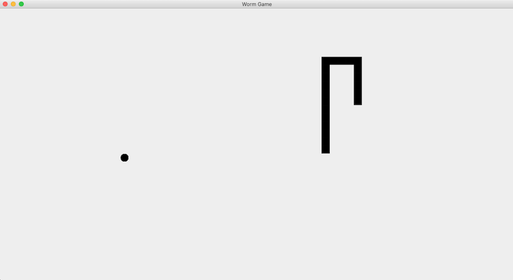

# **Worm Game (AKA Snake)**

# Description
This is my implementation of the classic [Snake video game](https://www.youtube.com/watch?v=DekS8Pgb1qc). I built it using Java, AWT, and Swing. It was the [final project](https://materiaalit.github.io/2013-oo-programming/part2/week-12/#e49) for the [University of Helsinki's object-oriented programming MOOC](http://moocfi.github.io/courses/2013/programming-part-1/) and results in a user- controlled worm that can eat and grow from the apples it pursues.

It utilizes concepts and structures such as inheritance, GUI, threads, enum, packages, classes, instance methods, interfaces, and Lists.

[Click here to watch a video demo of this app.](https://www.youtube.com/watch?v=jnsBAmoliUo)

Here's a screenshot of the game. Click it for a larger version.

#

# Project Files
The following links contain summary overviews of each file used in the project. Please refer to a file's code directly for specific implementation and details regarding that file.

* [Main.java](#Main.java)
* [Direction.java](#Direction.java)
* [Piece.java](#Piece.java)
* [Apple.java](#Apple.java)
* [Worm.java](#Worm.java)
* [WormGame.java](#WormGame.java)
* [DrawingBoard.java](#DrawingBoard.java)
* [KeyboardListener.java](#KeyboardListener.java)
* [Updatable.java](#Updatable.java)
* [UserInterface.java](#UserInterface.java)

## Main.java
This is where the program runs from. It instantiates a new WormGame and UserInterface, makes the program thread-safe, prepares the game for updates according to user actions, and starts the game.

## Direction.java
An enum that holds directions for our worm to travel in.

## Piece.java
A class that returns the x and y coordinates of pieces that make up our worm.

## Apple.java
Builds the apple for the game.

## Worm.java
A class that creates a new worm composed of instances from the Piece class. It can also move and grow an existing worm.

## WormGame.java
A class that creates the worm game and gives it functionality.

## DrawingBoard.java
A class that draws the worm and the apple for the game.

## KeyboardListener.java
A class that handles worm movement input from the user.

## Updatable.java
University of Helsinki MOOC's distribution code that updates the game in real time.

## UserInterface.java
Creates the window and its components for the game to run in.

# License & Copyright
© Alex Guidace

Licensed under the [MIT License](License).
